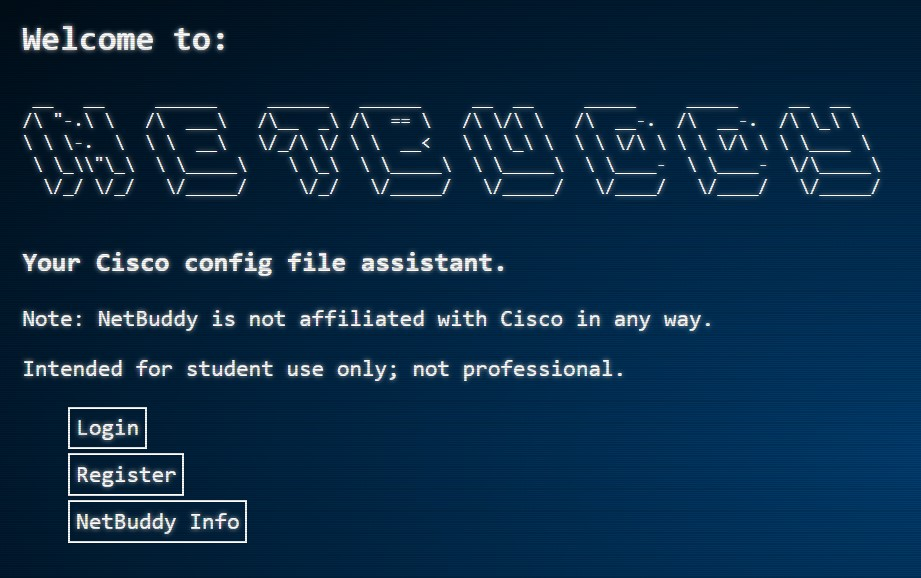

# NetBuddy
Your Cisco config file assistant.

## What is NetBuddy?

NetBuddy is an application that allows
people studying for the Cisco exams to save their device
configurations. Users can create an account, connect with their Cisco
device, and save configurations files to a TFTP server as well as add
descriptions for context. Users can also recall saved configurations
and load them to their connected device. It was written in Python
using the Django framework and uses the Django ORM to manage
the database. Also, the Netmiko library was used to create an SSH
connection with the device and send it commands.

### Note : NetBuddy currently only supports Cisco IOS routers.

## Setup:

## The Router

1. Setup your Cisco device's SSH connection from global configuration mode.

- Example:

  ` R1# configure terminal`

  `R1(config)# ip domain-name CCNA-lab.com`

  `R1(config)# username admin privilege 15 secret adminpass1`

  `R1(config)# line vty 0 4`

  `R1(config-line)# transport input ssh`

  `R1(config-line)# login local`

  `R1(config-line)# exit`

  `R1(config)# crypto key generate rsa modulus 1024`

2. Turn file prompt to quiet. This allows the TFTP commands to be sent in one line.

- `R1(config)#file prompt quiet`

## The App

1. Clone the repo and `cd` into it.

2. Create your virtual environment.

- for OSX

  `python -m venv netbuddyenv`

  `source ./netbuddyenv/bin/activate`

- for Windows

  `python -m venv netbuddyenv`

  `source ./netbuddyenv/Scripts/activate`

3. Install the app's dependencies.

- `pip install -r requirements.txt`

4. Build your database from the existing models.

  - `python manage.py makemigrations netbuddyapp`
  - `python manage.py migrate`

5. Create a superuser.

  - `python manage.py createsuperuser`

6. Start server.

  - `python manage.py runserver`

7. Head to http://localhost:8000/, login with your superuser username and password, and have fun!

## NetBuddy FAQ

1. How are configurations saved and loaded?

- NetBuddy will save and load configurations via the database in string format as well as the TFTP server (if you specified one during registration). You are able to choose where you load from but NetBuddy will save to both the database and the TFTP server (if available) automatically.

2. How can I check if my connections to the router and TFTP server are working?

- When you visit the home page, you will see messages concerning the connection state of both the router and TFTP server.

3. I had a previous configuration loaded and then loaded another. I now see elements of my previous configuration. Why?

- When loading configurations, elements of the config file are only over-written if there was an entry for the same element in the previous configuration. Otherwise, it is added. It is advised to start from a base configuration including only the two steps listed under the Router portion of the Setup instructions before you load a configuration.

4. I sure would like to use a serial connection with NetBuddy.

- The next step for NetBuddy is to integrate PySerial and then you would not need a base configuration to start with.

5. What if I want to use NetBuddy for a switch?

- NetBuddy is currently not designed to work with switches. Saving and recalling switch functionality would need to take VLANs into account, which I have not (besides asking for a VLAN ip address during registration to be used in a future NetBuddy).

6. I would like to edit my profile information as well as router and TFTP server ip but alas I cannot.

- Currently, NetBuddy does not have the ability to edit profile information (it's on the list). Please create a new user with the proper information in the meantime.

7. I don't like the blue background.

- https://css-tricks.com

8. Wow! This is really cool. I would love to have the person who created this on my team.

- Well shucks, thanks! Good news; I am looking for a career. Feel free to get in touch: https://linkedin.com/in/treysuiter

9. I used this app for my multi-billion dollar business and now I have compromised its security.

- Very unfortunate. NetBuddy is intended for student use only; not professional. Also, if you would let me know the name of the business as I suspect they may have an opening soon.

10. Where can I get information about the Netmiko library for my own project?

- https://pynet.twb-tech.com/blog/automation/netmiko.html

11. Hey, where are the fixtures?

- As I have no idea what ip you will be using for your router or TFTP server, creating fixtures would serve no purpose. Also, a filename in the netbuddyapp_routerconfiguration table would not have an immediate corresponding file on your TFTP server.

## The Lab

